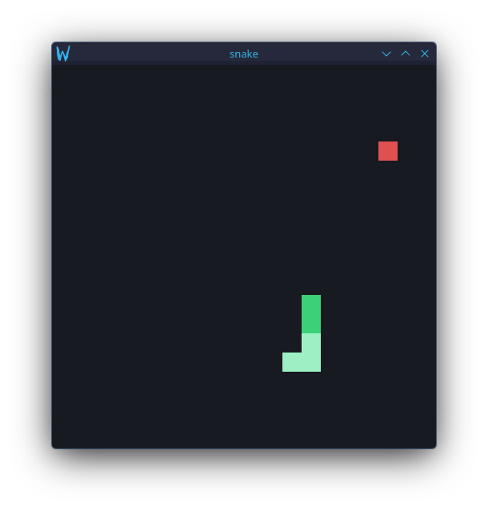

# aufhebung

A small, low-level windowing library for native Wayland applications.

`aufhebung` handles the Wayland bookkeeping that sits between an application and
`wl_surface`: surface roles, xdg-shell configure handshakes, toplevel metadata,
keyboard and pointer input, and event collection.
It does **not** own your event loop.
Buffers, timing, scheduling, and runtime integration remain in the application.
The core API is synchronous and blocking; the underlying Wayland socket is also
available directly, so an application can integrate it with any event loop or
runtime it wants.

> **Early software.** The API is unstable.
> The library currently focuses on windows, sub-surfaces, buffers, and keyboard
> and pointer input.

## Examples



```sh
cargo run --features tokio --example snake
```

The Snake example is built from the library's low-level pieces: one `wl_surface`
for the window, a sub-surface per snake segment and for the food, and a tiny
`wl_buffer` per colour, scaled to fill its surface.
Normal movement reuses the tail surface instead of allocating a new one, so the
surface count tracks the snake's length.
Movement is driven by a Tokio timer, and compositor events and timer ticks are
handled by the same `tokio::select!`.

Use `w/a/s/d`, `h/j/k/l`, or the arrow keys to steer.
Press `p` or Space to pause and `q` to quit.
After a collision the board stays still while the title flashes; once the flash
ends, any key starts another round.

```sh
cargo run --example cookie-clicker
```

The Cookie Clicker example is the other half of what the library offers, and the
one that needs no features: it is driven entirely by the pointer, so the
blocking `Display::dispatch` loop is the whole runtime.
Its window is a background, and the cookie and the oven are sub-surfaces on top
of it, each a solid colour.
Click the cookie to bake; click the oven to buy one that bakes more per click.
Both are recognised by the id on the `PointerEvent::Button`, with no geometry to
work out and no position conversion to do — a sub-surface reports the surface it
was hit on. The cookie darkens with every oven bought and lightens under the
pointer, and the title carries the score.

Press `q` to quit.

## Usage

The smallest application can use the blocking dispatcher directly:

```rust
use aufhebung::{
    color::Color,
    display::Display,
    state::{Event, SurfaceEvent},
    surface::{SurfaceInfo, SurfaceRole},
};

fn main() -> Result<(), Box<dyn std::error::Error>> {
    let mut display = Display::new()?;

    let white = display.add_color(Color::WHITE);

    let id = display
        .add_surface(SurfaceInfo {
            width: 800,
            height: 800,
            role: SurfaceRole::Window {
                title: "hello".into(),
            },
        })
        .expect("no surface id available");

    loop {
        display.dispatch()?;

        for event in display.events() {
            if let Event::SurfaceEvent {
                event: SurfaceEvent::Configure { width, height },
                ..
            } = event
            {
                println!("{id:?} configured to {width}x{height}");
                display.commit(id, &white);
            }
        }
    }
}
```

A toplevel must receive its first `configure` before the application commits its
first buffer.
`aufhebung` exposes that state directly rather than hiding the handshake behind a
window abstraction: `Display::is_configured` reports it, and each configure
arrives as a `SurfaceEvent::Configure`.

## API

The reference lives in the [API documentation](https://docs.rs/aufhebung).
The shape of it:

### `Display`

* `new` connects to the Wayland compositor.
* `add_surface` and `remove_surface` manage surfaces by `SurfaceId`.
* `surface` and `surfaces` reach existing surfaces.
* `commit` attaches a buffer by id — the short form of `surface(id)?.commit(…)`.
* `is_configured`, `is_window`, and `should_close` query one surface by id.
* `set_title` and `set_size_limits` forward to the same surface.
* `dispatch` runs the complete blocking event loop.
* `events` drains the events collected by the library.
* `translate_key` and `translate_char` resolve a key through the compositor's
  keyboard map.
* `add_color` creates a buffer containing a solid colour.
* `connection_fd`, `socket`, `prepare_read`, `dispatch_pending`, and `flush`
  expose the pieces needed to integrate the connection into another event loop.

### `Surface`

* `commit` attaches a buffer, fills the surface with it, and damages the full
  surface.
* `set_position` moves a sub-surface.
* `set_size_limits` constrains a toplevel's requested size.
* `is_configured` reports whether a toplevel has completed its initial
  configure handshake.
* `title` and `set_title` read and write the toplevel's title.
* `should_close` and `is_window` expose the role's state.
* `width` and `height` report the last configured size.

### `SurfaceRole`

A surface is created with one of three roles:

```rust
SurfaceRole::Window {
    title: "hello".into(),
}
```

A toplevel window.

```rust
SurfaceRole::Subsurface {
    parent,
    x,
    y,
    sync,
}
```

A positioned child surface.
`sync` chooses whether its changes wait for the parent to be committed; see the
[`surface` module documentation](https://docs.rs/aufhebung/latest/aufhebung/surface/index.html)
before changing it.
Needs a compositor that advertises `wl_subcompositor`; `add_surface` answers
`None` on one that does not.

```rust
SurfaceRole::None
```

A bare `wl_surface`.

### `Color`

`Color` is an RGBA colour with 8 bits per channel, with conversions from the
usual literals.
`Display::add_color` turns one into a buffer that can be committed to a surface.

### Re-exports

The public API speaks types from `wayland-client`, `wayland-protocols`, `kbvm`,
and `slotmap`, so all four are re-exported:

```rust
use aufhebung::wayland_client::protocol::wl_buffer::WlBuffer;
use aufhebung::{kbvm, slotmap, wayland_protocols};
```

`aufhebung` is then the only dependency an application needs to declare.

Do not add `wayland-client` yourself. This crate depends on a pinned git
revision, and Cargo treats a different source as a different crate, so the two
`WlBuffer` types will not unify — declaring `wayland-client = "0.31"` produces
`error[E0308]: mismatched types ... there are multiple different versions of
crate wayland_client in the dependency graph`.
Going through the re-export cannot have that problem, because it is the same
crate this library already uses.

### Seats

`translate_key` and `translate_char` resolve a key through one seat's keymap and
modifier state, so they take a `SeatId` — the `id` on the `SeatEvent` that
carried the key.
Translating a key and handling the event it arrived on are therefore the same
step.
A seat is bound when the compositor advertises it, which may be after startup if
an input device appears, and a `SeatId` stops resolving once the compositor
withdraws that seat.
A seat need not have a keyboard or a pointer, and neither is used before the
compositor advertises it.

### Pointers

A pointer reports through `SeatEvent::Pointer`, carrying a `PointerEvent`:

* `Enter`, `Leave`, and `Motion` name the surface the pointer is on, and the
  first two also give the position.
* `Button` adds the time, the `Button` that went down or up, and whether it was
  pressed. The position here is the one from the last `Enter` or `Motion`:
  the protocol's own button event names no coordinates, so this is the only way
  to know where a click landed.
* `Axis` is scroll wheel movement, as a direction and a value.

Positions are relative to the surface named, so a sub-surface reports its own
origin and an application does not have to convert them to the parent. That also
means a click needs no hit testing: comparing the surface id is enough to know
what was clicked.

Events for surfaces this connection did not create are ignored, exactly as they
are for the keyboard, so a pointer moving over some other window's surface is
not reported at all.

The pointer proxy is not kept, on the same reasoning as the keyboard's: this
crate sends no request on it — there is no cursor surface and no pointer
constraints — so there is nothing to hold it for.

## Tokio

Tokio support is optional:

```toml
[dependencies]
aufhebung = { version = "0.1", features = ["tokio"] }
```

The `tokio` feature provides `Reactor`, which registers the Wayland connection
socket with Tokio and folds waiting, reading, dispatching, and flushing into one
operation:

```rust
let mut reactor = Reactor::new(&display)?;

let from_compositor = tokio::select! {
    biased;

    read = reactor.recv(&mut display) => {
        read?;
        true
    }

    _ = stepper.tick() => false,
};
```

The feature is disabled by default.
`Reactor` is a convenience rather than a second abstraction: it is built on the
same public `Display` operations that are available without it, so another
runtime can drive those four calls directly instead.
It borrows nothing, so the `Display` can be borrowed mutably while it waits, and
it holds the connection open for as long as it lives — the `Display` should
still outlive it, since everything the `Display` owns is gone once it is
dropped.

## Why not winit?

For most applications, [winit] is the right choice.
It is mature, cross-platform, widely used, and provides facilities that
`aufhebung` does not attempt to provide.
`aufhebung` exists for applications that specifically want a smaller,
Wayland-native layer.

|                         | winit 0.30                               | aufhebung                         |
| ----------------------- | ---------------------------------------- | --------------------------------- |
| Platforms               | Windows, macOS, Linux, Android, iOS, web | Wayland                           |
| Window abstraction      | `Window`, `ApplicationHandler`           | `wl_surface`, roles, configs      |
| Pointer input           | Yes                                      | Buttons, motion, scroll           |
| Text input              | Yes                                      | No                                |
| Clipboard               | Yes                                      | No                                |
| Monitor/output handling | Yes                                      | No                                |
| Sub-surfaces            | Not directly                             | Yes                               |
| Event loop              | Owns the application loop                | Application owns the socket       |
| Async integration       | External integration required            | Direct socket integration         |
| Scope                   | Cross-platform windowing                 | Wayland surface/window primitives |

It is the better fit in a few situations:

**Wayland-only applications.**
There is no need to carry X11, Windows, or macOS abstractions for an application
that will never use them.

**Sub-surface-heavy applications.**
Sub-surfaces are first-class objects rather than something reached around the
window abstraction to obtain.

**Application-owned event loops.**
The Wayland socket can be one source in an existing `select!`, poller, reactor,
or runtime.

**A small dependency surface.**
The Wayland protocol and keyboard handling are implemented without depending on
the system Wayland or X11 libraries.

[winit]: https://github.com/rust-windowing/winit

## System libraries

The crate requires no shared Wayland, X11, or xkbcommon libraries on the target
system.
`wayland-client`'s `system` and `dlopen` features are disabled, so the connection
uses its Rust backend and talks to the compositor socket directly, and protocol
bindings are generated at compile time.

Keyboard maps are handled by [kbvm], a Rust implementation of the relevant xkb
functionality, rather than by `libxkbcommon`.
No external `xkeyboard-config` data files are needed either: the map arrives from
the compositor as part of `wl_keyboard.keymap` and is compiled in memory.

[kbvm]: https://crates.io/crates/kbvm

## Limitations

This is deliberately a small API.
It currently does **not** provide:

* text input;
* clipboard support;
* `wl_output` / monitor enumeration;
* frame callbacks;
* client-side decorations;
* decoration mode reporting.

Keyboard handling exposes both translated characters and raw keysyms.
Keys that do not correspond to a character, beyond the navigation keys handled by
`translate_char`, are available through `translate_key`.

Pointer handling reports positions, buttons, and scroll.
A sub-surface's size is fixed when it is created — only a toplevel is ever
configured again — so there is no way to resize one, and no way to resize a
window directly either; a client asks the compositor to resize through
`set_size_limits` and a `Configure` reports the result.

The seat is bound at version 1, so pointer events above that version
(`frame`, `axis_source`, `axis_stop`, `axis_discrete`, and later additions) are
not reported, and touch is not handled at all.

## Requirements

A Wayland compositor is the only runtime requirement.

The repository contains a `rust-toolchain.toml` that currently pins nightly for
development.
The crate itself does not intentionally require nightly language features.
